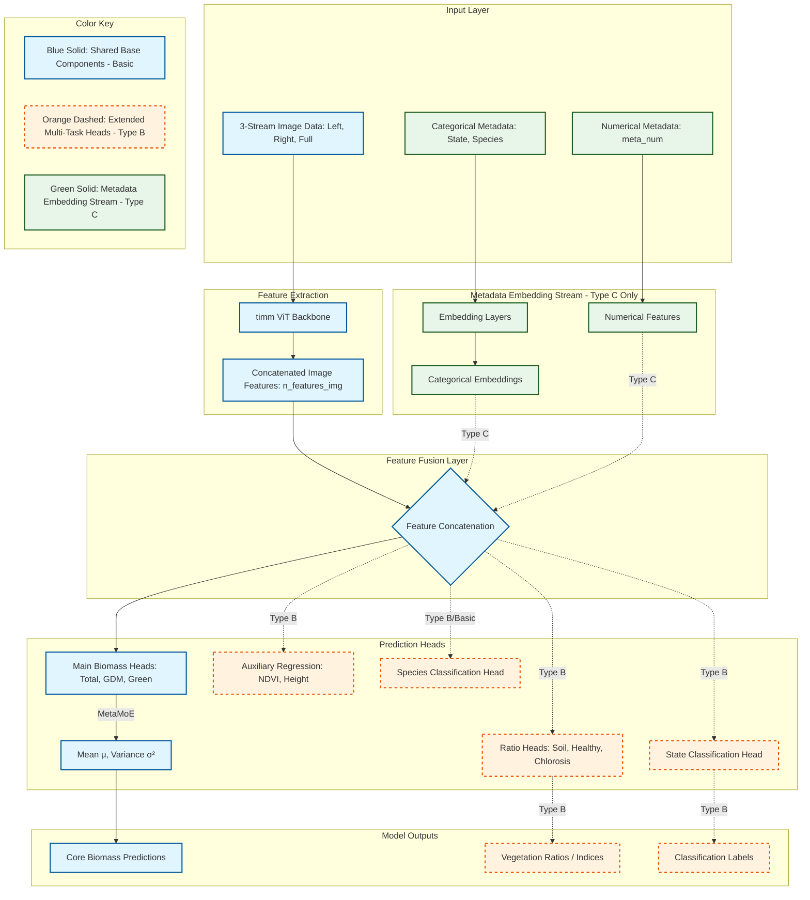

```mermaid
graph TD
    %% Style Definitions
    classDef basic fill:#e1f5fe,stroke:#01579b,stroke-width:2px;
    classDef typeB fill:#fff3e0,stroke:#e65100,stroke-width:2px,stroke-dasharray: 5 5;
    classDef typeC fill:#e8f5e9,stroke:#1b5e20,stroke-width:2px;
    classDef meta fill:#f3e5f5,stroke:#4a148c,stroke-width:2px;

    %% Input Layer
    subgraph Inputs [Input Layer]
        IMG_IN[3-Stream Image Data: Left, Right, Full]:::basic
        META_CAT[Categorical Metadata: State, Species]:::typeC
        META_NUM[Numerical Metadata: meta_num]:::typeC
    end

    %% Backbone Stream
    subgraph Backbone_Stream [Feature Extraction]
        BB[timm ViT Backbone]:::basic
        BB --> F_IMG[Concatenated Image Features: n_features_img]:::basic
    end

    %% Metadata Processing (Type C Only)
    subgraph Meta_Processing [Metadata Embedding Stream - Type C Only]
        META_CAT --> EMB[Embedding Layers]:::typeC
        EMB --> F_META[Categorical Embeddings]:::typeC
        META_NUM --> F_NUM[Numerical Features]:::typeC
    end

    %% Feature Fusion
    subgraph Fusion [Feature Fusion Layer]
        F_IMG --> JOIN{Feature Concatenation}:::basic
        F_META -.->|Type C| JOIN
        F_NUM -.->|Type C| JOIN
    end

    %% Task Heads
    subgraph Task_Heads [Prediction Heads]
        %% Shared Core Heads
        JOIN --> H_CORE[Main Biomass Heads: Total, GDM, Green]:::basic
        H_CORE --> |MetaMoE| OUT_CORE[Mean μ, Variance σ²]:::basic

        %% Type B Additional Tasks
        JOIN -.->|Type B| H_RATIO[Ratio Heads: Soil, Healthy, Chlorosis]:::typeB
        JOIN -.->|Type B| H_AUX[Auxiliary Regression: NDVI, Height]:::typeB
        JOIN -.->|Type B/Basic| H_SPEC[Species Classification Head]:::typeB
        JOIN -.->|Type B| H_STATE[State Classification Head]:::typeB
    end

    %% Outputs
    subgraph Outputs [Model Outputs]
        OUT_CORE --> RES1[Core Biomass Predictions]:::basic
        H_RATIO -.->|Type B| RES2[Vegetation Ratios / Indices]:::typeB
        H_STATE -.->|Type B| RES3[Classification Labels]:::typeB
    end

    %% Legend
    subgraph Legend [Color Key]
        L1[Blue Solid: Shared Base Components - Basic]:::basic
        L2[Orange Dashed: Extended Multi-Task Heads - Type B]:::typeB
        L3[Green Solid: Metadata Embedding Stream - Type C]:::typeC
    end

    IMG_IN --> BB
```
