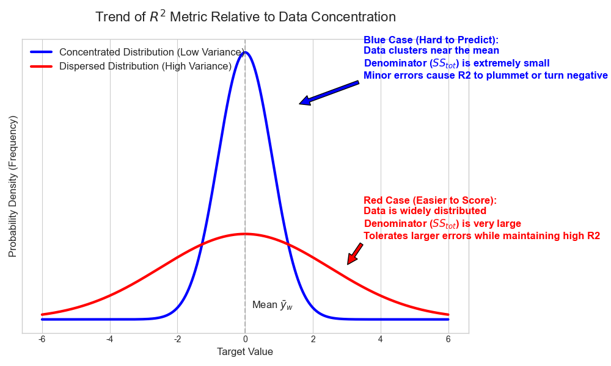
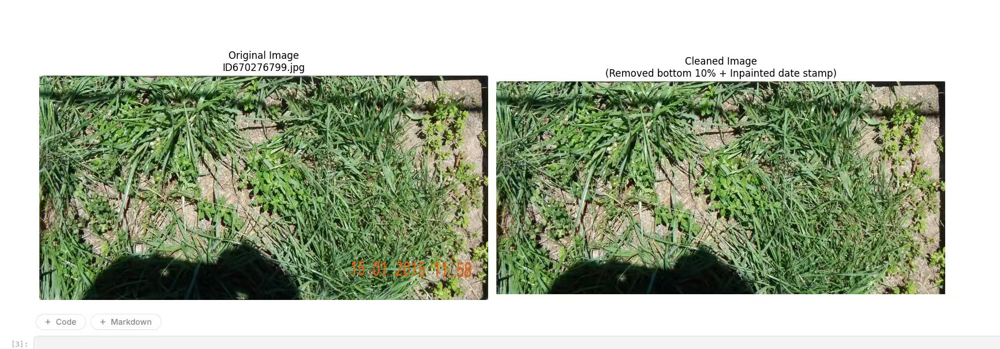
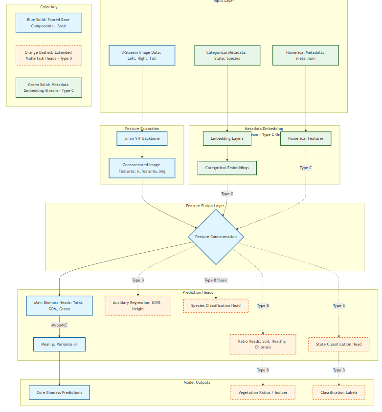

# CSIRO Image2Biomass Prediction - 第5名Solo金牌方案

首先感谢Kaggle和CSIRO组织这次比赛，这是一个非常有意义的农业AI应用场景。

## 1. 开场白

这是我第一次参加Kaggle CV比赛，很高兴也很幸运最后取得solo第五名（Private LB: 0.76）。在整个比赛过程中，我做了大量的实验——**关于训练的实验我做了差不多100多次**（从exp-v1到exp-v188）。通过这次比赛我学到了很多关于计算机视觉的知识，下面是关于我比赛方案的具体分享。

## 2. 比赛理解

### 2.1 问题描述

本次比赛的目标是使用牧场图像预测五个关键的生物质组分：
- **Dry_Green_g** - 干绿色植被（不包括三叶草）
- **Dry_Dead_g** - 干枯死物质
- **Dry_Clover_g** - 干三叶草生物质
- **GDM_g** - 绿色干物质
- **Dry_Total_g** - 总干生物质

### 2.2 数据特点

- **训练集规模较小**：约800多张图像
- **图像尺寸**：原始图像为2000x1000像素
- **存在分布差异**：训练集和测试集分布有明显差异
- **多州数据**：数据来自澳大利亚不同州（NSW, Tas, Vic, WA）
- **物理约束关系**：目标之间存在物理关系
  - Dead = Total - GDM
  - Clover = GDM - Green



### 2.3 评估指标

比赛使用加权R²分数作为评估指标，对五个目标的R²进行加权平均。

## 3. 核心上分点

经过大量消融实验，以下是在当前方案上可以稳定上分的关键技术：

### 3.1 图像预处理 - 去除时间戳

原始图像中包含橙色的日期时间戳，这是一种数据噪声。我使用HSV颜色空间检测并使用图像修复技术去除这些时间戳：

```python
def clean_image(img):
    """
    图像预处理：去除底部伪影和日期戳
    """
    # 在HSV空间检测橙色日期戳
    hsv = cv2.cvtColor(img, cv2.COLOR_RGB2HSV)
    # 定义橙色范围
    lower = np.array([5, 150, 150])
    upper = np.array([25, 255, 255])
    mask = cv2.inRange(hsv, lower, upper)

    # 膨胀掩码以覆盖文字边缘
    mask = cv2.dilate(mask, np.ones((3, 3), np.uint8), iterations=2)

    # 如果检测到时间戳，则进行修复
    if np.sum(mask) > 0:
        img = cv2.inpaint(img, mask, 3, cv2.INPAINT_TELEA)

    return img
```



### 3.2 多种数据增强

由于训练集规模较小，数据增强对于防止过拟合至关重要。我使用了TTA风格的训练策略：

```python
def get_tta_transforms(img_size: int) -> list[A.Compose]:
    """返回用于TTA风格训练的变换管道列表"""
    normalize = A.Normalize(
        mean=[0.485, 0.456, 0.406],
        std=[0.229, 0.224, 0.225]
    )

    # View 0: 原始视图
    original_view = A.Compose([
        A.Resize(img_size, img_size),
        normalize,
        ToTensorV2()
    ])

    # View 1: 水平翻转
    hflip_view = A.Compose([
        A.Resize(img_size, img_size),
        A.HorizontalFlip(p=1.0),
        normalize,
        ToTensorV2()
    ])

    # View 2: 垂直翻转
    vflip_view = A.Compose([
        A.Resize(img_size, img_size),
        A.VerticalFlip(p=1.0),
        normalize,
        ToTensorV2()
    ])

    # View 3: 旋转90度
    rotate90_view = A.Compose([
        A.Resize(img_size, img_size),
        A.Rotate(limit=(90, 90), p=1.0, border_mode=0),
        normalize,
        ToTensorV2()
    ])

    return [hflip_view, vflip_view, rotate90_view, original_view]
```

**训练策略**：
- 前15个epoch：使用增强视图（hflip, vflip, rotate90）进行训练，相当于4倍数据
- 后续epoch：仅使用原始视图
- **关键发现**：随机选择增强方式比按epoch顺序选择效果更好（exp-v174）

### 3.3 多视图输入架构

除了将图像分为左右两半进行处理（模拟立体视觉），我还加入了完整图像作为第三个输入流：

```python
class BiomassDataset(Dataset):
    """三流数据集：将2000x1000的图像分成左半、右半和完整图像"""
    
    def __getitem__(self, idx: int):
        image = self._load_image(self.image_paths[idx])
        image = clean_image(image)

        height, width = image.shape[:2]
        mid = width // 2
        left = image[:, :mid]      # 左半部分
        right = image[:, mid:]     # 右半部分
        full_image = image.copy()  # 完整图像

        # 对三个视图应用相同的变换
        left = self.transform(image=left)["image"]
        right = self.transform(image=right)["image"]
        full_image = self.transform(image=full_image)["image"]

        return left, right, full_image, train_tgt, eval_tgt, species_tgt
```

这种设计允许模型同时学习局部细节（左右视图）和全局上下文（完整视图）。

### 3.4 Mixture-of-Experts (MoE) 模型架构

**设计初衷**：模型能根据输入图像的具体情况（如是绿草多还是枯草多）自动切换最擅长的专家进行预测，从而有效解决多任务学习时的特征冲突。

```python
class MetaMoE(nn.Module):
    """用于主要目标的混合专家头，输出均值和方差"""

    def __init__(self, in_dim: int, hidden: int, num_experts: int, 
                 out_dim: int = 1, dropout: float = 0.2):
        super().__init__()
        self.num_experts = num_experts
        
        # 门控网络
        self.gate = nn.Sequential(
            nn.LayerNorm(in_dim),
            nn.Linear(in_dim, 256),
            nn.ReLU(),
            nn.Linear(256, num_experts),
        )
        
        # 专家网络（每个输出均值和方差）
        self.experts = nn.ModuleList([
            nn.Sequential(
                nn.LayerNorm(in_dim),
                nn.Linear(in_dim, hidden),
                nn.ReLU(),
                nn.Dropout(dropout),
                nn.Linear(hidden, 256),
                nn.ReLU(),
                nn.Linear(256, 2),  # [mean, var_logit]
            )
            for _ in range(num_experts)
        ])

    def forward(self, x: torch.Tensor):
        gate_logits = self.gate(x)
        gate_weights = F.softmax(gate_logits, dim=1).unsqueeze(-1)
        expert_outs = torch.stack([expert(x) for expert in self.experts], dim=1)
        out = (expert_outs * gate_weights).sum(dim=1)

        pred_mean = out[:, 0:1]
        pred_var_logit = out[:, 1:2]
        pred_var = F.softplus(pred_var_logit) + 1e-6  # 确保方差为正

        return pred_mean, pred_var
```



**三种模型变体**：
- **Model Type A (BiomassModelBasic)**: 基础三流模型（exp-v147, exp-v164, exp-v174）
- **Model Type B (BiomassModelWithStateSpecies)**: 带State/Species分类头（exp-v142）
- **Model Type C (BiomassModelWithMetaEmbedding)**: 带元特征嵌入（exp-v148）

### 3.5 辅助训练头（Auxiliary Heads）

添加额外的训练目标可以帮助模型学习更丰富的特征表示：

```python
class BiomassModel(nn.Module):
    def __init__(self, model_name: str, pretrained: bool = True, 
                 pretrained_path: str = '', num_species: int = 0):
        super().__init__()
        # ... backbone初始化 ...
        
        # 主要回归头（使用MoE）
        self.head_total = MetaMoE(...)
        self.head_gdm = MetaMoE(...)
        self.head_green = MetaMoE(...)
        
        # 辅助回归头（NDVI和Height）
        self.head_ndvi = _AuxHead(self.n_features, self.n_features // 2)
        self.head_height = _AuxHead(self.n_features, self.n_features // 2)
        
        # 可选的分类头
        if num_species > 0:
            self.head_species = self._make_classification_head(num_species)
```

**辅助目标**：
- Pre_GSHH_NDVI（归一化植被指数）
- Height_Ave_cm（平均牧草高度）
- Species（物种分类，15类）
- State（州分类，4类）

### 3.6 物理一致性损失（Physics Consistency Loss）

根据目标之间的物理关系设计损失函数，使用GaussianNLLLoss作为主要损失函数：

**核心优势**：
- 针对 R² 指标对**离群点误差平方级敏感**的特性
- 通过 GaussianNLL 自动降低高噪样本权重（避免被脏数据带偏）
- 利用物理约束锁定预测合理性（避免逻辑矛盾导致的巨大误差）

```python
class PhysicsConsistencyLoss(nn.Module):
    """
    物理一致性损失，使用GaussianNLLLoss
    
    关键优势：
    - 自动处理离群值：模型学习为噪声样本预测高方差
    - 处理异方差性：不同生物质水平有不同的不确定性
    - 物理约束：Dead = Total - GDM, Clover = GDM - Green
    """

    def __init__(self, weights: dict[str, float] = None):
        super().__init__()
        self.w = {
            "total": 0.45,
            "gdm": 0.2,
            "green": 0.1,
            "dead": 0.1,
            "clover": 0.1,
            "ndvi": 0.0,
            "height": 0.0,
            "species": 0.05
        }
        self.criterion = nn.GaussianNLLLoss()

    def forward(self, preds, targets, species_targets=None):
        # 直接预测的损失
        loss_total = self.criterion(pred_total_mean, gt_total, pred_total_var)
        loss_gdm = self.criterion(pred_gdm_mean, gt_gdm, pred_gdm_var)
        loss_green = self.criterion(pred_green_mean, gt_green, pred_green_var)
        
        # 物理约束损失
        # Dead = Total - GDM
        pred_dead_mean = pred_total_mean - pred_gdm_mean
        pred_dead_var = pred_total_var + pred_gdm_var
        gt_dead = gt_total - gt_gdm
        loss_dead = self.criterion(pred_dead_mean, gt_dead, pred_dead_var)
        
        # Clover = GDM - Green
        pred_clover_mean = pred_gdm_mean - pred_green_mean
        pred_clover_var = pred_gdm_var + pred_green_var
        gt_clover = gt_gdm - gt_green
        loss_clover = self.criterion(pred_clover_mean, gt_clover, pred_clover_var)
        
        # 加权总损失
        total_loss = (
            self.w["total"] * loss_total +
            self.w["gdm"] * loss_gdm +
            self.w["green"] * loss_green +
            self.w["dead"] * loss_dead +
            self.w["clover"] * loss_clover
        )
        return total_loss
```

### 3.7 分层学习率（Layer-wise Learning Rate）

为预训练的Backbone和新初始化的Head设置不同的学习率：

```python
param_groups = []
for name, param in model.named_parameters():
    if 'backbone' in name:
        # Backbone使用较小学习率保留预训练能力
        param_groups.append({
            'params': param, 
            'lr': cfg.finetune_lr * cfg.backbone_lr_mult  # 通常0.1
        })
    elif 'head' in name:
        # Head使用较大学习率快速拟合
        param_groups.append({
            'params': param, 
            'lr': cfg.finetune_lr * cfg.head_lr_mult  # 通常1.0
        })
    else:
        param_groups.append({'params': param, 'lr': cfg.finetune_lr})

optimizer = optim.AdamW(param_groups, weight_decay=cfg.weight_decay)
```

**原理**：为预训练的Backbone设置较小学习率以保留其通用的特征提取能力（防止破坏预训练权重），同时为新初始化的Head设置较大学习率以快速拟合当前特定任务。

### 3.8 后处理策略

#### 3.8.1 基于State的后处理

通过分析发现WA州的数据特点与其他州不同：

```python
# WA州特殊处理：Dead为0，Total等于GDM
if predicted_states_df is not None:
    final_pred = final_pred.merge(predicted_states_df, on='image_path', how='left')
    is_wa = final_pred['Predicted_State'] == 'WA'
    final_pred.loc[is_wa, 'Dry_Dead_g'] = 0
    final_pred.loc[is_wa, 'Dry_Total_g'] = final_pred.loc[is_wa, 'GDM_g']
```

#### 3.8.2 基于统计的范围截断

根据训练集各州的目标值统计范围进行结果截断：

```python
state_stats = {
    'Tas': {'Dry_Clover_g': {'min': 0.0, 'max': 71.79}, ...},
    'NSW': {'Dry_Clover_g': {'min': 0.0, 'max': 10.10}, ...},
    'WA':  {'Dry_Clover_g': {'min': 0.0, 'max': 58.88}, ...},
    'Vic': {'Dry_Clover_g': {'min': 0.0, 'max': 67.90}, ...}
}

for state in state_stats.keys():
    state_mask = final_pred['Predicted_State'] == state
    for var in target_vars:
        min_val = state_stats[state][var]['min']
        max_val = state_stats[state][var]['max']
        final_pred.loc[state_mask, var] = final_pred.loc[state_mask, var].clip(
            lower=min_val, upper=max_val
        )
```

#### 3.8.3 缩放后处理

```python
def apply_post_processing(df: pd.DataFrame) -> pd.DataFrame:
    """应用Clover和Dead的后处理规则"""
    df_out = df.copy()
    if 'Dry_Clover_g' in df_out.columns:
        df_out['Dry_Clover_g'] = df_out['Dry_Clover_g'] * 0.8
    if 'Dry_Dead_g' in df_out.columns:
        mask_high = df_out['Dry_Dead_g'] > 20
        df_out.loc[mask_high, 'Dry_Dead_g'] *= 1.1
        mask_low = df_out['Dry_Dead_g'] < 10
        df_out.loc[mask_low, 'Dry_Dead_g'] *= 0.9
    return df_out
```

### 3.9 全量数据集训练

因为训练集比较小，初衷是利用上所有数据集，仅仅过拟合训练集。

```python
# train_df = df[df["fold"] != fold].reset_index(drop=True)
# valid_df = df[df["fold"] == fold].reset_index(drop=True)

train_df = df
valid_df = df
```

## 4. 模型融合

### 4.1 最终融合方案

最终提交使用了6个模型的加权融合：

| 模型 | 权重 | 特点 |
|------|------|------|
| exp-v142 | 0.0 (仅用于State预测) | BiomassModelWithStateSpecies，提取State信息 |
| exp-v148 | 0.15 | BiomassModelWithMetaEmbedding，利用元特征 |
| exp-v147 | 0.20 | BiomassModelBasic，seed=2026 |
| exp-v174 | 0.25 | BiomassModelBasic，随机数据增强 |
| exp-v164 | 0.20 | BiomassModelBasic，TTA式数据增强 |
| exp-v177 | 0.20 | BiomassModelBasic，调整损失权重 |

### 4.2 TTA推理

每个模型使用3种TTA变换：
1. 原始视图
2. 水平翻转
3. 垂直翻转

最终预测取平均值。

### 4.3 双GPU并行推理

为了加速推理，实现了双GPU并行推理：

```python
def parallel_dual_gpu_inference(dataset, model_class, model_kwargs, model_states, ...):
    """在两个GPU上并行运行推理"""
    # 偶数索引 -> GPU 0，奇数索引 -> GPU 1
    indices_0 = list(range(0, n, 2))
    indices_1 = list(range(1, n, 2))
    
    with ThreadPoolExecutor(max_workers=2) as executor:
        future_0 = executor.submit(inference_single_gpu, model_0, ..., device_0)
        future_1 = executor.submit(inference_single_gpu, model_1, ..., device_1)
        results_0 = future_0.result()
        results_1 = future_1.result()
    
    # 合并结果
    ...
```

## 5. 关键超参数

| 超参数 | 值 |
|--------|-----|
| Backbone | vit_large_patch16_dinov3_qkvb |
| 图像尺寸 | 1024x1024 |
| Batch Size | 4 |
| 学习率 | 2e-4 (warm-up后finetune为5e-5) |
| Backbone学习率倍率 | 0.1 |
| 训练轮数 | 25 |
| MoE专家数 | 4 |
| MoE隐藏层维度 | 512 |
| 优化器 | AdamW |
| Weight Decay | 1e-4 |

## 6. 失败的尝试

根据实验记录，以下方法没有带来提升或效果不稳定：

### 6.1 没有效果的方法

| 实验 | 描述 | 结果 |
|------|------|------|
| exp-v36 | 使用比率预测 | CV从0.58降到0.43 |
| exp-v97 | 整张图片不分流 | CV 0.57, LB 0.52（严重下降）|
| exp-v99 | 学习率2e-4+20轮 | CV仅0.21 |
| exp-v123 | 分割图像+注意力 | CV 0.53, LB 0.53 |
| exp-v168/169 | Mamba Network | CV 0.80-0.89（不稳定）|
| exp-v180 | UNet原尺寸1000x2000 | LB 0.64（下降明显）|

### 6.2 效果不稳定的方法

| 实验 | 描述 | 问题 |
|------|------|------|
| Huge模型 (exp-v170) | vit_huge | CV很高0.95但LB 0.72 |
| 30轮训练 (exp-v161) | 增加训练轮数 | 过拟合，Private LB下降 |
| 多种分割mask | ng/xg mask | 部分有效但不稳定 |

### 6.3 经验总结

1. **更大的模型不一定更好**：huge模型容易过拟合小数据集
2. **训练轮数需要控制**：25轮左右是最佳平衡点
3. **复杂的注意力机制收益有限**：在小数据集上容易过拟合
4. **Mamba等序列模型架构不适合此问题**

## 7. 实验进展历程

### 7.1 分数提升关键节点

| 阶段 | 实验 | Public LB | Private LB | 关键改进 |
|------|------|-----------|------------|----------|
| 基线 | v1 | 0.57 | - | 448尺寸baseline |
| 模型升级 | v24 | 0.65 | - | vit_large_dinov3 |
| 分辨率 | v32 | 0.69 | - | 512尺寸 |
| 物理Loss | v42 | 0.69+ | - | PhysicsConsistencyLoss |
| MoE | v44 | 0.69 | - | 混合专家架构 |
| 1024分辨率 | v108 | 0.73 | - | 1024尺寸+学习率优化 |
| 全量训练 | v136 | 0.74+ | - | 全量数据集+Species |
| 种子优化 | v147 | 0.75+ | - | seed=2026 |
| 数据增强 | v164 | 0.75 | - | TTA式数据增强 |
| 随机增强 | v174 | 0.76 | 0.65 | 随机选择增强方式 |
| 融合 | 最终 | 0.76 | **0.66** | 6模型加权融合 |

### 7.2 最终Private LB分数分布

根据提交记录，选中的两个最终提交：
- Public LB: 0.76, Private LB: 0.66（第5名）

## 8. 总结与经验分享

### 8.1 成功的关键因素

1. **大量实验**：做了188+次实验，充分探索了方案空间
2. **物理约束**：利用目标之间的物理关系设计损失函数
3. **多样化融合**：不同种子、不同架构、不同训练策略的模型融合
4. **数据增强**：在小数据集上，合理的数据增强至关重要
5. **后处理**：基于数据分析的后处理策略

### 8.2 关于选分

这次比赛选分非常困难，主要原因：
- 数据集规模小，模型容易过拟合
- 训练集和测试集分布存在差异
- Public LB和Private LB相关性不高

我最终选择了Public LB最高的提交，虽然Private LB不是最优（0.66 vs 某些失败提交的0.65），但相对稳定。

### 8.3 运气成分

必须承认这次成绩有一定的运气成分：
- 看到前排很多大佬在shake-up中抖动
- 选分策略恰好没有踩坑
- 多模型融合提高了稳定性

### 8.4 致谢

非常感谢：
- Kaggle社区的无私分享
- 各位Kaggler的讨论和notebook
- CSIRO组织方提供这个有意义的比赛

这次solo金牌对于我成为Grandmaster非常重要！希望这份方案分享能帮助到大家。

---

**代码仓库**：完整的训练和推理代码请参考比赛提交的notebook。

**最终提交Notebook**: [CSIRO-Ensemble-Models-V12](https://www.kaggle.com/code/quincyqiang/csiro-ensemble-models-v12?scriptVersionId=294382133)
